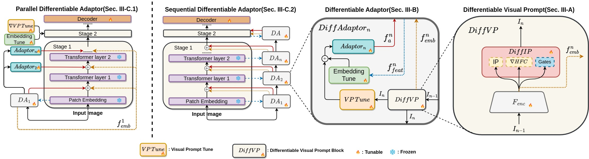

# DiffPrompter: Differentiable Implicit Visual Prompts for Object-Segmentation in Adverse Conditions

Sanket Kalwar*, Mihir Ungarala*, Shruti Jain*, Aaron Monis, Krishna Reddy Konda, Sourav Garg, K Madhava Krishna

## Abstract
Semantic segmentation in adverse weather scenarios is a critical task for autonomous driving systems. While foundation models have shown promise, the need for specialized adaptors becomes evident for handling more challenging scenarios.

We introduce DiffPrompter, a novel differentiable visual and latent prompting mechanism aimed at expanding the learning capabilities of existing adaptors in foundation models. Our proposed ∇HFC image processing block excels particularly in adverse weather conditions, where conventional methods often fall short. Furthermore, we investigate the advantages of jointly training visual and latent prompts, demonstrating that this combined approach significantly enhances performance in out-of-distribution scenarios.

Our differentiable visual prompts leverage parallel and series architectures to generate prompts, effectively improving object segmentation tasks in adverse conditions. Through a comprehensive series of experiments and evaluations, we provide empirical evidence to support the efficacy of our approach.

## Architecture


**Note: In this repo, PDA architecture is refered as DVP_P and SDA architecture is refered as DVP_S in this repo**


## Demo
```bash
python3 demo.py --config [CONFIG_FILE_PATH] --model [MODEL_PATH] --input_dir [INPUT_DIR_PATH] --output_dir [OUTPUT_DIR_PATH]
```
`[INPUT_DIR_PATH]` = Path to input images directory

`[OUTPUT_DIR_PATH]` = Path to directory where output images will be saved (If this path does not exists, it will be created using ```os.makedirs()```)

`[MODEL_PATH]` = Path to model checkpoint

`[CONFIG_FILE_PATH]` = Path to configuration file related to the model 

## Test
```bash
python3 test.py --model [MODEL_PATH] --config [CONFIG_FILE_PATH]
```

`[MODEL_PATH]` = Path to model checkpoint

`[CONFIG_FILE_PATH]` = Path to configuration file related to evaluation dataset 

## Quich Guide
1. Create a new conda environment
2. Install necessary packages (Run commands in order from ```instructions.txt```)
3. Download model checkpoint from the links given. (Recommended to create a ```./weights``` folder and store checkpoint file in there.)
4. Download the dataset from the links given and store it in ```./load``` folder.
5. Demo:
```bash
python3 demo.py --config configs/dvp_p_configs/demo_dvp_p.yaml --model weights/dvp_vitb_parallel_bdd100k_last.pth --input_dir demo_imgs/input --output_dir demo_imgs/output

```
6. Evaluation:
```bash
python3 test.py --model weights/dvp_vitb_parallel_bdd100k_last.pth --config configs/dvp_p_configs/test_dvp_p_acdc.yaml
```


## Links

Datasets [[LINK](https://iiitaphyd-my.sharepoint.com/personal/sanket_k_research_iiit_ac_in/_layouts/15/onedrive.aspx?ga=1&id=/personal/sanket_k_research_iiit_ac_in/Documents/RRC/ICRA2024/DVP/Final_Weights_and_Datasets/datasets)]

**Model Checkpoints**

| Dataset | PDA/DVP_parallel | SDA/DVP_serial |
| :-----: | :----------: | :--------: |
| BDD100k | [Link](https://iiitaphyd-my.sharepoint.com/personal/sanket_k_research_iiit_ac_in/_layouts/15/onedrive.aspx?ga=1&id=/personal/sanket_k_research_iiit_ac_in/Documents/RRC/ICRA2024/DVP/Final_Weights_and_Datasets/weights/dvp_vitb_p_bdd100k_last.pth&parent=/personal/sanket_k_research_iiit_ac_in/Documents/RRC/ICRA2024/DVP/Final_Weights_and_Datasets/weights) | [Link](https://iiitaphyd-my.sharepoint.com/personal/sanket_k_research_iiit_ac_in/_layouts/15/onedrive.aspx?ga=1&id=/personal/sanket_k_research_iiit_ac_in/Documents/RRC/ICRA2024/DVP/Final_Weights_and_Datasets/weights/dvp_vitb_s_bdd100k_last.pth&parent=/personal/sanket_k_research_iiit_ac_in/Documents/RRC/ICRA2024/DVP/Final_Weights_and_Datasets/weights) |
| ACDC | [Link](https://iiitaphyd-my.sharepoint.com/personal/sanket_k_research_iiit_ac_in/_layouts/15/onedrive.aspx?ga=1&id=/personal/sanket_k_research_iiit_ac_in/Documents/RRC/ICRA2024/DVP/Final_Weights_and_Datasets/weights/dvp_vitb_p_bdd100k_best.pth&parent=/personal/sanket_k_research_iiit_ac_in/Documents/RRC/ICRA2024/DVP/Final_Weights_and_Datasets/weights) | [Link](https://iiitaphyd-my.sharepoint.com/personal/sanket_k_research_iiit_ac_in/_layouts/15/onedrive.aspx?ga=1&id=/personal/sanket_k_research_iiit_ac_in/Documents/RRC/ICRA2024/DVP/Final_Weights_and_Datasets/weights/dvp_vitb_s_bdd100k_last.pth&parent=/personal/sanket_k_research_iiit_ac_in/Documents/RRC/ICRA2024/DVP/Final_Weights_and_Datasets/weights) |
| Dark Zurich | [Link](https://iiitaphyd-my.sharepoint.com/personal/sanket_k_research_iiit_ac_in/_layouts/15/onedrive.aspx?ga=1&id=/personal/sanket_k_research_iiit_ac_in/Documents/RRC/ICRA2024/DVP/Final_Weights_and_Datasets/weights/dvp_vitb_p_bdd100k_best.pth&parent=/personal/sanket_k_research_iiit_ac_in/Documents/RRC/ICRA2024/DVP/Final_Weights_and_Datasets/weights) | [Link](https://iiitaphyd-my.sharepoint.com/personal/sanket_k_research_iiit_ac_in/_layouts/15/onedrive.aspx?ga=1&id=/personal/sanket_k_research_iiit_ac_in/Documents/RRC/ICRA2024/DVP/Final_Weights_and_Datasets/weights/dvp_vitb_s_bdd100k_last.pth&parent=/personal/sanket_k_research_iiit_ac_in/Documents/RRC/ICRA2024/DVP/Final_Weights_and_Datasets/weights) |
| Wild Dash | [Link](https://iiitaphyd-my.sharepoint.com/personal/sanket_k_research_iiit_ac_in/_layouts/15/onedrive.aspx?ga=1&id=/personal/sanket_k_research_iiit_ac_in/Documents/RRC/ICRA2024/DVP/Final_Weights_and_Datasets/weights/dvp_vitb_p_bdd100k_last.pth&parent=/personal/sanket_k_research_iiit_ac_in/Documents/RRC/ICRA2024/DVP/Final_Weights_and_Datasets/weights) | [Link](https://iiitaphyd-my.sharepoint.com/personal/sanket_k_research_iiit_ac_in/_layouts/15/onedrive.aspx?ga=1&id=/personal/sanket_k_research_iiit_ac_in/Documents/RRC/ICRA2024/DVP/Final_Weights_and_Datasets/weights/dvp_vitb_s_bdd100k_best.pth&parent=/personal/sanket_k_research_iiit_ac_in/Documents/RRC/ICRA2024/DVP/Final_Weights_and_Datasets/weights) |


## Acknowledgements

The code is borrowed heavily from [EVP](https://github.com/NiFangBaAGe/Explicit-Visual-Prompt). We thank the author for sharing their wonderful code.

